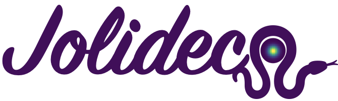

Jolideco is a Python library for Joint Likelihood deconvolution of a set of observations 
in the presence of Poisson noise. It can be used to combine data from multiple x-ray instruments
such as `Chandra <https://cxc.harvard.edu/chandra/>`_, 
`XMM-Newton <https://www.cosmos.esa.int/web/xmm-newton>`_ or gamma-ray instruments such as
`Fermi-LAT <https://fermi.gsfc.nasa.gov/>`_ or `H.E.S.S. <https://www.mpi-hd.mpg.de/hfm/HESS/>`_.
Jolideco is designed to work with data from any instrument affected by Poisson noise.

I improves both the spatial resolution of the observations
and signal to noise ratio.

"Jolideco" is short for "(Jo)int (Li)kelihood (Deco) onvolution" and means
"pretty decoration" in French. 

Jolideco relies on `Pytorch <https://pytorch.org/>`_.

.. toctree::
  :maxdepth: 2

  user/index.rst
  user/tutorials/index
  api/index.rst
  developer.rst
  references.rst
  changelog.rst
