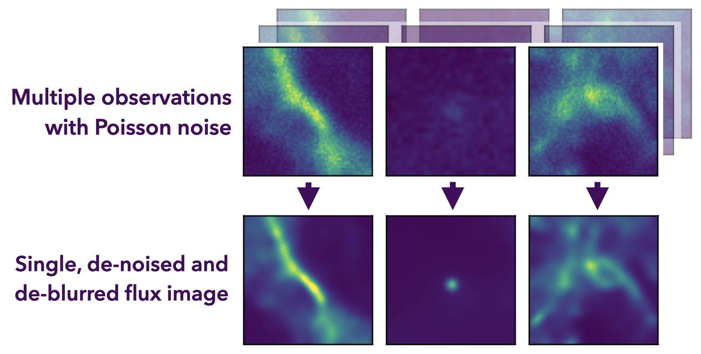
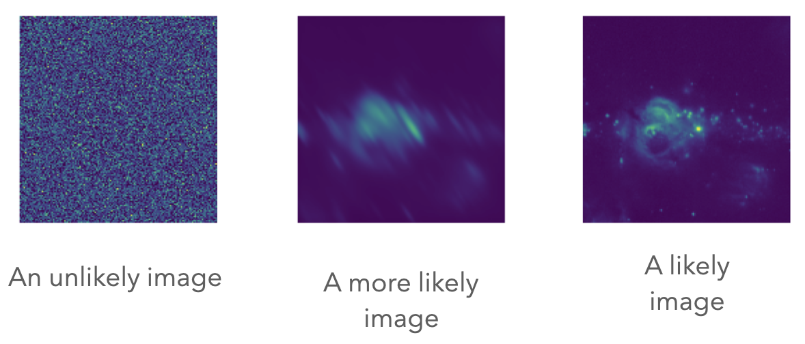
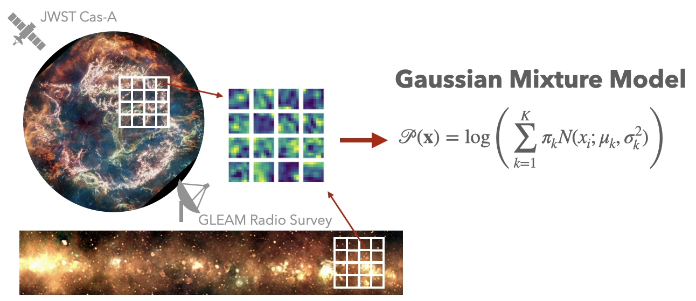

********
Overview
********

Motivation
==========

All astronomical observations are affected by limited resolution, noise and instrumental effects.
This is especially true for observations in the high energy regime, such as X-rays and gamma-rays,
where the number of photons is limited and dominated by Poisson noise. To maximize the scientific
output of the available data, it is thus desired to deblur and denoise the data. In addition it is
also desirable to combine data from different observations to increase the statistics. 
The process is illustrated in the following figure:

.. _jolideco_illustration:

    
    Illustration of the Jolideco method. The input data are multiple images of the observed counts,
    a model of the PSF and the exposure map. The output is a single reconstructed flux image.

Given such a set of observations from the same region of the sky, **Jolideco aims to reconstruct
a single deblurred and denoised flux image from all observations**. The assumption is that the underlying flux
does not change between the observations. This includes, but is not limited, to the following scenarios:

* Different observations with one instrument or telescope at different times and observation conditions.
  For example, multiple observations of Chandra or an IACT of the same astrophysical object with different
  offset angles and exposure times
* Different observations from different instruments or telescopes, which operate in the same wavelength range.
  For example, a Chandra and XMM observation of the same region in the sky
* A single observation with one telescope with different data quality categories and different associated
  instrument response functions, such as event classes for Fermi.
* In principle also images at different energies, for example from the Fermi-LAT. However in this case
  the assumption is that the flux does not change with energy, which is not always fulfilled.

For each of the observations **Jolideco can take the specific instrument response functions into account**.
The approach is illustrated in the figure above. Using all available data Jolideco then reconstructs 
a common flux image using a maximum a posterior estimate (MAP).

Image Priors
============

A naive reconstruction (deblurring) of the flux, for example using the `Richardson Lucy algorithm <https://en.wikipedia.org/wiki/Richardson–Lucy_deconvolution>`_,
results in very `spiky and poor images <_images/sphx_glr_first-steps_003.png>`_. So the most important part of the method is the
underlying prior assumption on the structure of the images. Intuitively scientists know very 
well which structures are likely found in astronomical images, because they have learned it from looking
at many images before. See for example the following illustration:

    Examples of an unlikely, more likely and very likely structure in astronomical images.

Now the question is how to encode this intuition into a mathematical model. In general deep learning
models are a great choice for this, however in the case of astronomical images scientists are often
interested to evaluate the full likelihood, for example to calculate confidence intervals. This limits 
the choice of models. 

Instead Jolideco chooses a more traditional approach and uses a pacth based 
Gaussian mixture model (GMM) as a prior. This approach was introduce by :cite:t:`Zoran2011`
and later adapted to astronomical radio images by :cite:t:`Bouman2016`. The latter was
for example used to produce the black hole images of M87 from the Event Horizon Telescope.

The idea is simple: some reference image with high signal-to-noise ratio is split into patches of 
a size of 8x8 pixels. Then a high dimensional Gaussian mixture model (GMM) is fitted to the patches
to learn the distribution of pixel values including the covariance. See the following figure:

    Illustration of learning the GMM patch prior: the reference image is split into patches of 8x8 pixels,
    for which a high dimensional GMM is fitted. Each pixel represents an independent dimension.

When reconstructing the image, the GMM prior is used to regularize the solution: for each patch in the
image to be reconstructed, the pre-trained GMM is used to calculate the likelihood of the current flux 
in the patch. This likelihood is then maximized in the optimization process across all overlapping patches.
This happens "brute force" by choosing the mixture component that maximizes the likelihood each patch. 

.. warning::

  While the patch prior is very flexible and can adapt to structures in the data, it can still
  lead to "hallucinations" in the reconstructed images. This is especially the case if the 
  data is not varify informative (few statistics / low counts). In any case it is important 
  to carefully check the results and possibly compare them to other methods. 

In addition one can adapt the choice of the GMM prior to the specific analysis scenario. 
For convenience Jolideco provides a set of pre-trained GMM priors to use:

.. list-table:: Pre-trained GMM priors
   :widths: 25 25 25 50
   :header-rows: 1

   * - Name
     - Data Origin
     - GMM components
     - Analysis Scenario
   * - `"gleam"``
     - GLEAM Survey
     - 128
     - Multipurpose, Galactic Structure
   * - `"jwst-cas-a"``
     - JWST PR image of Cas A
     - 128
     - Multipurpose, Galactic Structure, SNRs, requires high signal-to-noise
   * - `"zoran-weiss"``
     - Zoran et al. 2011, every day images
     - 256
     - No point sources, not recommended to use. But might work for extended structures.

.. warning::

The priors are available in the `GMM prior library repository <https://github.com/jolideco/jolideco-gmm-prior-library>`_
Jolideco also provides parameteric priors, those are listed in the :doc:`../api/priors`.

If you are interested in more details of the method, please have a look at the `Jolideco paper <https://github.com/adonath/jolideco-paper/raw/main-pdf/ms.pdf>`_.