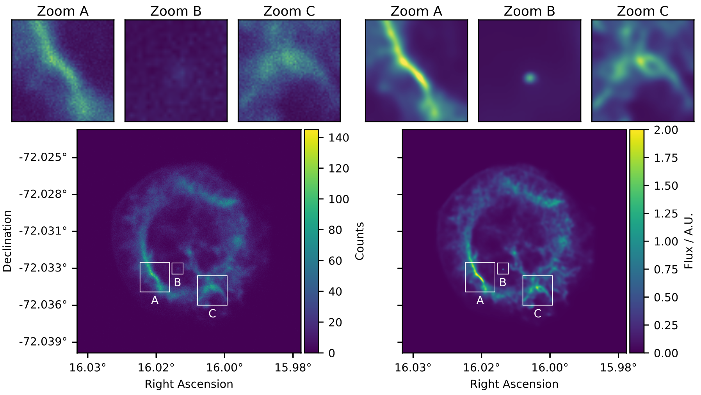

# Summary
The resolution or "sharpness" of any astronomical image is limited by the
telescope used and the observation conditions under which the data was taken.
The resolution power of a telescope is characterised by its point spread
function (PSF). In addition telescopes also leave an imprint on the image,
because of non-uniform exposure and instrument specific background noise.
Specifically, in the field of x-ray and gamma-ray astronomy, the data is subject
to Poisson noise, which further degrades the quality of the image. To maximize
the scientific output of the data, it is desirable to deblur the image, reduce
its noise and correct for any other imprint the instrument might have left on
the image. When correcting for those effects it also becomes possible to combine
data from different observatories to further maximize the scientific value of
the images.

# Method
If the characteristics of the point spread function (PSF) of the instrument are
known, it is possible to deblur the image using so-called "un-blind"
deconvolution methods. As the process is inherently ill-posed, meaning the
result is not unique, it is necessary to use a priori information about the
spatial structures contained in the image. For this Jolideco uses a special
patch based image prior, which is trained on a real astronomical
images from other wavelengths, such as the GLEAM readio survey and JWST
obervations of Cassiopeia A. This method is implemented in the Jolideco Python
package. An example result of the method is shown in Figure \autoref{fig:example}.

# Statement of need
Traditionally, the data of x-ray and gamma-ray telescopes is analyzed using
software specific to the observatory the data was taken with. While this
software is already often open source, there is generally a lack of software
that allows astronomers to combine data from different observatories. This is
because funding is often tied to specific observatories. 

Typically the measurements from different instruments are combined in
a single spectral energy distribution (SED) and then analyzed. However
Jolideco extends this concept to the image domain. Making it possible to combine
the images from different observatories while accounting for their different
instrument response functions such PSF, exposure and background.

Combined fitting of simple parametric morphological models to gamma-ray
image data is for example supported by the Gammapy package [@Gammapy2023].
Similarly for x-ray data there is the Sherpa [@Freeman2001] package. However, to
our knowledge, Jolideco is first software to allow for combining data from
different observatories to reconstruct a complete image based model.

# Software overview
Jolideco is built on top of PyTorch [@Pytorch2019] as array and optimization
backend. It features a modular and object oriented design, which allows for easy
extension and customization of the main algorithm. The package is designed to be
used in both python scripts and as well as inertactively in Jupyter notebooks.
Jolideco uses Numpy [@Numpy2020] for additional array handling, and Astropy
[@Astropy2018] for handling of FITS files and WCS information. The package also
uses Matplotlib [@Hunter2007] to simplify the visualization of the results for users.

# Acknowledgements

We acknowledge contributions from Brigitta Sipocz, Syrtis Major, and Semyeong
Oh, and support from Kathryn Johnston during the genesis of this project.

# References
Example paper.bib file: